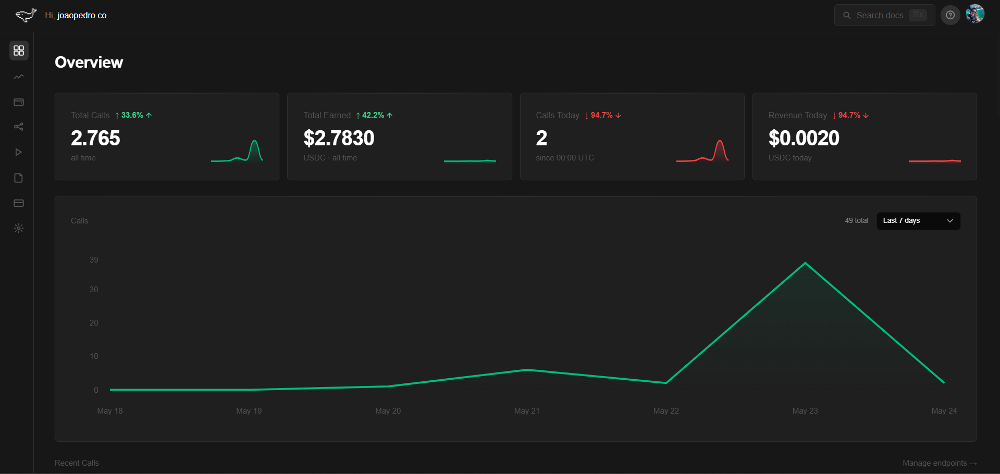

<div align="center">


# Gate402

**Billing infrastructure for AI agents.**

Drop-in middleware that charges agents in USDC on Solana.
No banks. No credit cards. No humans in the loop.

[](https://www.npmjs.com/package/gate402)
[](https://www.npmjs.com/package/gate402-agent)
[](LICENSE)
[](https://x402.org)

[**gate402.dev**](https://gate402.dev) · [Docs](https://gate402.dev/docs) · [npm](https://npmjs.com/package/gate402) · [Dashboard](https://gate402.dev/dashboard)

</div>

---

## What is Gate402?

Gate402 is a payment layer for the agentic economy.

AI agents call millions of APIs every day. None of them pay.
Gate402 fixes that with three lines of middleware.

When an agent hits your API without payment, Gate402 returns HTTP 402 with a Solana payment request. The agent pays in USDC, Gate402 verifies on-chain, and your handler executes. The money goes directly to your wallet. Gate402 never holds funds.

---

## How It Works

```
Agent calls /api/weather
       │
       ▼
Gate402 intercepts → HTTP 402 Payment Required
{
  "price":   "0.001 USDC",
  "payTo":   "7UQctU...939D",
  "network": "solana-devnet"
}
       │
       ▼
Agent sends USDC on Solana → confirmed in ~400ms
       │
       ▼
Gate402 verifies on-chain → forwards request
       │
       ▼
Your handler responds → call logged to dashboard
```

---

## Quick Start

### Provider — charge for your API

```bash
npm install gate402
```

```typescript
import { gate402 } from 'gate402'
import express from 'express'

const app = express()

app.use(gate402({
  apiKey:        'gk_live_...',           // from gate402.dev/dashboard
  walletAddress: 'your-solana-wallet',
  endpoints: {
    '/api/weather': 0.001,               // 0.001 USDC per call
    '/api/analyze': 0.01,
  },
}))

app.get('/api/weather', (req, res) => {
  res.json({ city: 'São Paulo', temp: '28°C' })
})

app.listen(3000)
```

### Agent — pay for APIs autonomously

```bash
npm install gate402-agent
```

```typescript
import { createAgent } from 'gate402-agent'

const agent = createAgent({
  walletPrivateKey: process.env.SOLANA_PRIVATE_KEY,
  network: 'devnet',
})

// Automatically handles HTTP 402 → pays → retries
const data = await agent.fetch('https://api.example.com/weather')
```

---

## MCP Integration

Connect Gate402 to Claude Desktop — let Claude pay for your APIs automatically.

```json
{
  "mcpServers": {
    "gate402": {
      "command": "node",
      "args": ["/path/to/gate402/apps/mcp-demo/dist/index.js"],
      "env": { "SERVER_URL": "https://your-server.com" }
    }
  }
}
```

Claude will discover your paywalled tools and pay per call without any human intervention.

---

## Dashboard



- Real-time call monitoring — every API call appears live
- USDC revenue tracking — total, daily, and per-endpoint
- 7-day and 30-day revenue charts
- Recent transactions with payer wallet addresses
- CSV export of full call history

---

## Project Structure

```
gate402/
├── apps/
│   ├── server/          # Express API + x402 middleware + Prisma
│   ├── dashboard/       # Next.js 15 dashboard (App Router)
│   └── mcp-demo/        # MCP server for Claude Desktop
├── packages/
│   └── sdk/             # gate402 npm package
└── README.md
```

---

## Stack

| Layer      | Technology                        |
|------------|-----------------------------------|
| Protocol   | x402 (HTTP 402 Payment Standard)  |
| Blockchain | Solana (devnet + mainnet)         |
| Token      | USDC                              |
| Middleware | Node.js · Express · TypeScript    |
| Database   | PostgreSQL (Supabase) · Prisma    |
| Cache      | Redis (ioredis)                   |
| Dashboard  | Next.js 15 · Recharts · Tailwind  |
| Auth       | Supabase Auth (GitHub + email)    |
| Hosting    | Vercel (dashboard) · Railway (API)|

---

## Environment Variables

**`apps/server/.env`**

| Variable                    | Description                                          |
|-----------------------------|------------------------------------------------------|
| `DATABASE_URL`              | PostgreSQL connection string (pooled)                |
| `DIRECT_URL`                | PostgreSQL direct connection (Prisma migrations)     |
| `REDIS_URL`                 | Redis connection string                              |
| `SOLANA_RPC_URL`            | Solana RPC endpoint                                  |
| `SOLANA_WALLET_ADDRESS`     | Server wallet public key (for verification)          |
| `SOLANA_WALLET_PRIVATE_KEY` | Server wallet private key — keep secret              |
| `PORT`                      | HTTP port (default: `3001`)                          |

**`apps/dashboard/.env.local`**

| Variable                        | Description                         |
|---------------------------------|-------------------------------------|
| `NEXT_PUBLIC_SERVER_URL`        | Gate402 API URL                     |
| `NEXT_PUBLIC_SUPABASE_URL`      | Supabase project URL                |
| `NEXT_PUBLIC_SUPABASE_ANON_KEY` | Supabase anon key                   |

---

## Running Locally

```bash
# 1. Clone and install
git clone https://github.com/your-username/gate402.git
cd gate402
npm install

# 2. Configure env files (see above)

# 3. Run database migrations
cd apps/server && npx prisma migrate dev

# 4. Start API server
npm run dev          # from apps/server

# 5. Start dashboard
npm run dev          # from apps/dashboard
# → http://localhost:3000
```

---

## Packages

| Package         | Description                              | Version |
|-----------------|------------------------------------------|---------|
| `gate402`       | Provider middleware for Express/Node.js  | [](https://npmjs.com/package/gate402) |
| `gate402-agent` | Agent SDK — auto-pays HTTP 402 responses | [](https://npmjs.com/package/gate402-agent) |

---

## License

MIT © Gate402

---

*Built on [x402 Protocol](https://x402.org) · Powered by [Solana](https://solana.com)*
